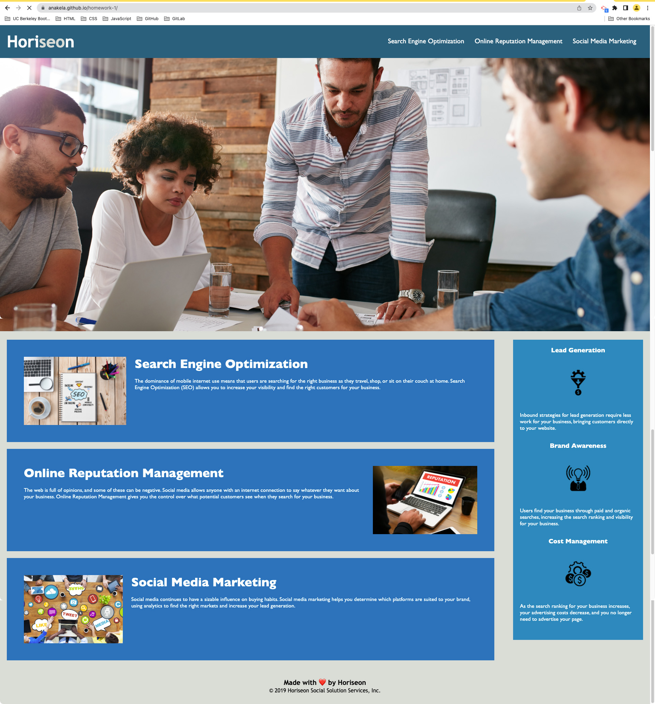

# Homework 1 - HTML CSS Git Challenge: Code Refactor

## Table of Contents

- [Overview](#overview)
  - [The Challenge](#the-challenge)
  - [User Story](#user-story)
  - [Acceptance Criteria](#acceptance-criteria)
  - [Screenshot](#screenshot)
  - [Links](#links)
- [My Process](#my-process)
  - [Built With](#built-with)
  - [What I Learned](#what-i-learned)
  - [Continued Development](#continued-development)
  - [Useful Resources](#useful-resources)
- [Author](#author)
- [Acknowledgments](#acknowledgments)

## Overview

### The Challenge

According to this week's module, the challenge is as follows:

>This week is an odd-numbered week, so your Challenge is an on-the-job ticket, which means you'll begin with starter code that you need to modify. This week's challenge involves a very important aspect of web development: accessibility.

>One of the most common tasks for front-end and junior developers is to take existing code and refactor it (recall that to refactor code is to improve it without changing what it does) to meet a certain set of standards or implement a new technology. In this Challenge, a marketing agency has hired you to refactor an existing site to make it more accessible.

>> #### NOTE
>>Your coursework this week will prepare you with all the skills that you need to succeed on this assignment!

>Web accessibility is an increasingly important consideration for businesses. It ensures that people with disabilities can access a website using assistive technologies such as video captions, screen readers, and braille keyboards. Making a website accessible is also good for business for many reasons, one of them being that accessible sites are better positioned in search engines like Google. It also helps companies avoid litigation that can occur when people with disabilities can't access their website.

>Even though accessibility is a broad topic that can include complex requirements, your tech lead has given you a small list of specific criteria to satisfy the project. These criteria are documented in the Acceptance Criteria section.

>> #### IMPORTANT
>>An important rule to follow when working with someone else's code is the Scout Rule, which recommends that you always leave the code a little cleaner than when you found it.

>To impress clients, you should always go the extra mile and improve the codebase for long-term sustainability. For example, make sure that all links are functioning correctly. Also, rework the CSS to make it more efficient by consolidating CSS selectors and properties, organizing them to follow the semantic structure of the HTML elements, and including comments before each element or section of the page.

>Are you ready to jump in? Here are this week's challenge requirements:

### User Story

>```
>AS A marketing agency
>I WANT a codebase that follows accessibility standards
>SO THAT our own site is optimized for search engines
>```

### Acceptance Criteria

>```
>GIVEN a webpage meets accessibility standards
>WHEN I view the source code
>THEN I find semantic HTML elements
>WHEN I view the structure of the HTML elements
>THEN I find that the elements follow a logical structure independent of styling and positioning
>WHEN I view the image elements
>THEN I find accessible alt attributes
>WHEN I view the heading attributes
>THEN they fall in sequential order
>WHEN I view the title element
>THEN I find a concise, descriptive title
>```

### Screenshot

#### Site After Refactoring HTML & CSS

Nothing in terms of the site's aesthetic has changed.



### Links

- Deployed Application URL: https://anakela.github.io/homework-1/ (Links to an external site.)
- GitHub Repository URL: https://github.com/anakela/homework-1 (Links to an external site.)

## My Process

I started this assignment by reviewing the HTML and CSS files respectively.  In the HTML file, I did the following:

- Added alt tags to all images.
- Replaced a multitude of `div` tags with semantic tags such as `header`, `main`, and `section`.
- Ensured that the semantic tags that were used were in sequential order.
- Updated the `title` tag to provide a succinct description of the site and what it does.

In the CSS file, I reviewed the CSS and combined selectors with identical key-value properties as much as possible.  This was to reduce redundancy and optimize accessibility, per the assignment's acceptance criteria.

### Built With

- VSCode
- Semantic HTML5 Markup
- CSS

### What I Learned

I learned that a web designer/developer can optimize a site's HTML and CSS and make it better for accessibility without changing a site's aesthetic.  For example, there were several instances in the CSS file where redundant key-value properties were listed separately.  Please see the example below:

#### Before Refactoring

```
.benefit-lead {
    margin-bottom: 32px;
    color: #ffffff;
}


.benefit-brand {
      margin-bottom: 32px;
    color: #ffffff;
}

benefit-cost {
    margin-bottom: 32px;
    color: #ffffff;
}
```

#### After Refactoring

I was able to refactor them as follows:

```
.benefit-lead, .benefit-brand, .benefit-cost {
    margin-bottom: 32px;
    color: #ffffff;
}
```

Refactoring not only can help with accessibility, but it can also help with 

Use this section to recap over some of your major learnings while working through this project. Writing these out and providing code samples of areas you want to highlight is a great way to reinforce your own knowledge.

To see how you can add code snippets, see below:

```html
<h1>Some HTML code I'm proud of</h1>
```

```css
.proud-of-this-css {
  color: papayawhip;
}
```

If you want more help with writing markdown, check out [The Markdown Guide](https://www.markdownguide.org/) to learn more.

**Note: Delete this note and the content within this section and replace with your own learnings.**

### Continued development

Use this section to outline areas that you want to continue focusing on in future projects. These could be concepts you're still not completely comfortable with or techniques you found useful that you want to refine and perfect.

**Note: Delete this note and the content within this section and replace with your own plans for continued development.**

### Useful resources

- [Example resource 1](https://www.example.com) - This helped me for XYZ reason. I really liked this pattern and will use it going forward.
- [Example resource 2](https://www.example.com) - This is an amazing article which helped me finally understand XYZ. I'd recommend it to anyone still learning this concept.

**Note: Delete this note and replace the list above with resources that helped you during the challenge. These could come in handy for anyone viewing your solution or for yourself when you look back on this project in the future.**

## Author

- Website - [Add your name here](https://www.your-site.com)
- Twitter - [@yourusername](https://www.twitter.com/yourusername)

**Note: Delete this note and add/remove/edit lines above based on what links you'd like to share.**

## Acknowledgments

This is where you can give a hat tip to anyone who helped you out on this project. Perhaps you worked in a team or got some inspiration from someone else's solution. This is the perfect place to give them some credit.

**Note: Delete this note and edit this section's content as necessary. If you completed this challenge by yourself, feel free to delete this section entirely.**